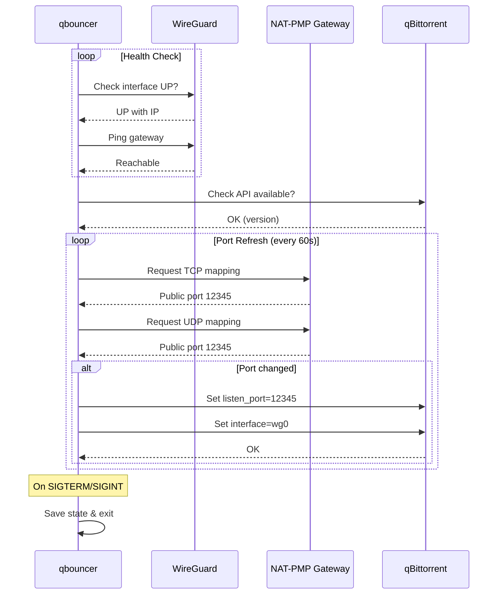

# qbouncer

A systemd service that monitors WireGuard VPN connectivity, manages NAT-PMP port mappings, and automatically keeps qBittorrent's listening port synchronized.

Designed for use with ProtonVPN's port forwarding feature, but should work with any VPN provider that supports NAT-PMP.

## Features

- Monitors WireGuard interface health (connectivity, handshake freshness)
- Requests NAT-PMP port mappings via `natpmpc`
- Automatically updates qBittorrent's listening port when the mapped port changes
- Ensures qBittorrent is bound to the VPN interface
- State machine with automatic recovery from failures
- systemd integration with watchdog support
- State persistence across restarts

## Requirements

- Python 3.9+
- `natpmpc` (from libnatpmp)
- `wireguard-tools` (for `wg` command)
- A running WireGuard VPN with NAT-PMP support
- qBittorrent with Web UI enabled

## Installation

### Automatic (recommended)

The installer will guide you through the setup interactively:

```bash
curl -fsSL https://raw.githubusercontent.com/vegardx/qbouncer/main/scripts/install.sh | bash
```

Or with options for non-interactive install:

```bash
curl -fsSL https://raw.githubusercontent.com/vegardx/qbouncer/main/scripts/install.sh | bash -s -- \
  --wg-interface wg0 \
  --gateway 10.2.0.1 \
  --qbt-port 8080 \
  --non-interactive
```

The installer is idempotent and can be run multiple times safely to upgrade or reconfigure.

### Manual

```bash
# Install system dependencies (Debian/Ubuntu)
apt install python3 python3-venv libnatpmp1 wireguard-tools

# Clone the repository
git clone https://github.com/vegardx/qbouncer.git
cd qbouncer

# Create service user
useradd -r -s /usr/sbin/nologin qbouncer

# Create installation directory and virtual environment
mkdir -p /opt/qbouncer
python3 -m venv /opt/qbouncer/venv

# Install qbouncer into the virtual environment
/opt/qbouncer/venv/bin/pip install .

# Setup configuration
mkdir -p /etc/qbouncer
cp config/qbouncer.toml.example /etc/qbouncer/qbouncer.toml
chmod 600 /etc/qbouncer/qbouncer.toml
nano /etc/qbouncer/qbouncer.toml

# Install and enable systemd service
cp systemd/qbouncer.service /etc/systemd/system/
systemctl daemon-reload
systemctl enable qbouncer
systemctl start qbouncer
```

### Uninstallation

```bash
./scripts/uninstall.sh
```

## Configuration

Configuration file: `/etc/qbouncer/qbouncer.toml`

```toml
[wireguard]
interface = "wg0"
health_check_host = "10.2.0.1"
health_check_interval = 30

[natpmp]
gateway = "10.2.0.1"
refresh_interval = 60
lease_lifetime = 120

[qbittorrent]
host = "localhost"
port = 8080
# use_https = false
# verify_ssl = true
# username = "admin"
# password = "secret"
interface_binding = "wg0"

[service]
log_level = "INFO"
state_file = "/var/lib/qbouncer/state.json"
```

### Environment Variables

All configuration options can be overridden via environment variables with the `QBOUNCER_` prefix:

```bash
QBOUNCER_WG_INTERFACE=wg0
QBOUNCER_NATPMP_GATEWAY=10.2.0.1
QBOUNCER_QBT_PORT=8080
QBOUNCER_LOG_LEVEL=DEBUG
```

## Usage

### As a systemd service

```bash
# Start the service
systemctl start qbouncer

# Check status
systemctl status qbouncer

# View logs
journalctl -u qbouncer -f

# Stop the service
systemctl stop qbouncer
```

### Manual execution

```bash
# Run with default config
/opt/qbouncer/venv/bin/qbouncer

# Run with custom config file
/opt/qbouncer/venv/bin/qbouncer --config /path/to/config.toml

# Run with verbose logging
/opt/qbouncer/venv/bin/qbouncer -v
```

## How It Works

1. **VPN Monitoring**: Checks that the WireGuard interface is UP, has an IP address, and can reach the gateway
2. **Port Mapping**: Requests TCP and UDP port mappings from the NAT-PMP gateway every 60 seconds
3. **qBittorrent Sync**: If the mapped port changes, updates qBittorrent's listening port via its Web API
4. **Interface Binding**: Verifies qBittorrent is bound to the VPN interface to prevent IP leaks

### Sequence Diagram



## Troubleshooting

### Check if WireGuard is working

```bash
# Verify interface is up
ip link show wg0

# Check connectivity
ping -I wg0 10.2.0.1

# Verify handshake
wg show wg0
```

### Check if NAT-PMP is working

```bash
# Request a port mapping manually
natpmpc -a 1 0 tcp 60 -g 10.2.0.1
```

### Check if qBittorrent API is accessible

```bash
# Get current preferences
curl http://localhost:8080/api/v2/app/preferences | jq .listen_port
```

### View service logs

```bash
# Full logs
journalctl -u qbouncer

# Follow logs
journalctl -u qbouncer -f

# Logs since last boot
journalctl -u qbouncer -b
```

## License

MIT License - see [LICENSE](LICENSE) for details.
